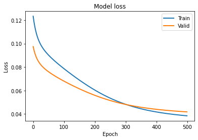
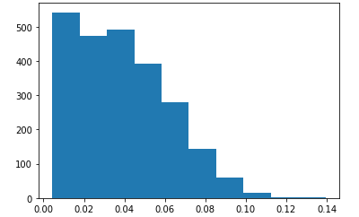
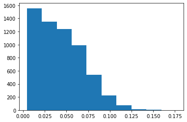

# Sentence Detection
#### A keras implementation of Bidirectional-LSTM for 'Neural sentence embedding using only in-domain sentences for out-of-domain sentence detection in dialog systems. 

To train Sentence Embedding Network, use only in-domain sentence by Bi-LSTM Network.  
After the sentence representation were learned, used them to train autoencoder aimed to at OOD sentence detection.

Data set consists of 12000 ID sentences for 6 domains: food,cloth,education,store,lifeservice,cafe and 6000 OOD sentecnes for 3 domains: hotel, leisure, accommodation.  

Use only ID sentence to train Autoencoder and Bi-LSTM(Neural sentence embedding).

#### To distinguish ID(in-domain), OOD(out-of-domain) sentence, I went through the following process.

1. To initialize embedding layer in Bi-LSTM network(Neural sentence embedding), use pre-trained word2vec model.
2. Use domain-category analysis as an auxiliary task to train Bi-LSTM(Neural sentence embedding) for OOD sentence detection.
3. After training the Bi-LSTM(Neural sentence embedding), used it's last hidden layer for sentence representation.
4. Use sentence representaion to train autoencdoer to detece OOD sentence by reconstruction error.

To test autoencoder, use 6000 OOD sentences and 2400 ID sentences.

#### Autoencoder Model Loss  
</img> 

#### ID-sentence reconstruction error rate  
</img> 

#### OOD-sentence reconstuction error rate  
</img> 

**Accuracy : 71.4%**

The implementation differs from the original paper in the following ways :

1. use different dataset : https://aihub.or.kr/aidata/85
2. use different word2vec model : https://github.com/Kyubyong/wordvectors

Reference : 
https://arxiv.org/abs/1807.11567
https://www.tensorflow.org/tutorials/generative/autoencoder?hl=ko
